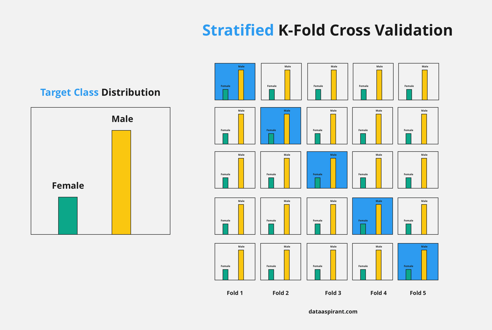

# 교차 검증(cross validation)

1. 교차검증의 설명과 사용 이유

2. 방법론
- KFold
- StratifiedKFold

3. 장단점
---

## 교차검증이란?

고정된 학습 데이터셋과 고정된 테스트 데이터셋으로 모델 학습을 진행할 경우,
테스트 데이터셋에만 최적의 성능을 발휘하도록 유도될 수 있음 (e.g. train_test_split) 
  -> overfitting

 
이 문제를 해결하기 위해 고안한 기법이 교차 검증(cross validation)

---

## 2-1. KFold

교차검증의 방법론 중 가장 basic한 기법

 

 

정말 간단한 방법이다  
*n_splits* 파라미터만 설정해주면 된다 상황을 가정하면서 생각해보자  

데이터셋의 크기가 1000개인 상황이다 
앞서 언급한 n_splits를 5로 줄 것이다 
1000개의 데이터가 5등분되고, 그 중 1개의 Fold가 validation set이 된다 
교차검증, 이름대로 5등분된 Fold들이 한번씩 validation set의 자격을 부여받아야 한다 
한번씩 자격을 얻기 위해서, 바로 떠오르는 방법이 for loop를 돌며 validation set 부여를 하는 것이다   

이러한 상황에서 우린 3가지 효과를 기대해 볼 수 있다

- 1000개의 데이터셋을 돌려가면서 알차게 쓰네 -> **underfitting** 해결
- 매번 데이터가 바뀌니까 모델 입장에서 새롭겠네 -> **overfitting** 해결
- 한정된 자원안에서 매번 다른 데이터로 테스트를 해볼 수 있네 -> **일반화**(정확도) 향상
- 아무래도 loop을 돌게 되니까 오래 걸리겠네 -> 계산, 시간 **cost** 증가

 

이 방법이 가장 기본적인 교차검증 기법, KFold이다  

--- 
## 2-2 StratifiedKFold
만약 내가 갖고있는 데이터셋의 class 분포가 한 쪽으로 편향되어있다면, KFold로 좋은 효과를 낼 수 있을까? 
예를들어, label:0 - 10개, label:1 - 990개로 구성된 데이터셋에서 KFold 기법으로 훈련을 하게 된다면, loop마다 train data에 label:0이 없게 되는 상황이 생길 수 있다  

쉽게 말해, 레이블 분포의 비율을 고려하는 것이 굉장히 중요한데 
이를 해결한 기법이 **StratifiedKFold** 기법이다

